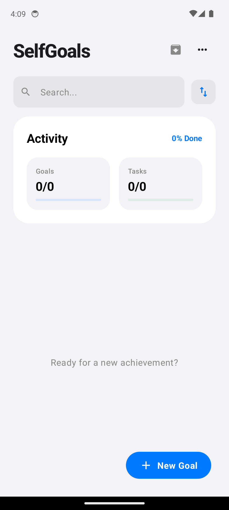

# SelfGoals 🎯

A high-polish, local-first Android application designed to help you define, track, and achieve your life goals. Built with a modern **iOS 18-inspired aesthetic**, SelfGoals combines powerful functionality with a fluid, tactile user experience.

**🌐 [Visit the Live Landing Page](https://clawedcode-git.github.io/SelfGoals/)**

## ✨ Features

-   **iOS 18 Design Language:** Modular "widget" layouts, glassmorphism, bold typography, and fluid squircle shapes.
-   **Custom Adaptive Icon:** A unique brand identity featuring a growth-oriented design with a vibrant blue-to-purple gradient.
-   **Haptic Feedback:** Tactile "clicks" and physical confirmation for key interactions (toggles, archiving, adding items) for a premium, responsive feel.
-   **Intelligent Analytics:** Real-time activity dashboard showing goal and task completion rates via modular overview tiles.
-   **Goal Management:** Create, **edit**, and track goals with detailed descriptions, custom categories, and **Priority** status (marked with a ⭐).
-   **Milestones (Sub-tasks):** Break down large goals into smaller, actionable milestones with automated progress tracking and **manual reordering** (Up/Down controls).
-   **Advanced Sorting:** Organize your dashboard by **Deadline**, **Progress**, **Creation Date**, **Name**, or **Priority**.
-   **Custom Theme Control:** Persistent Light/Dark mode settings using **Jetpack DataStore** that remember your preference across app restarts.
-   **Goal Archives:** Keep your dashboard focused by archiving completed goals. A dedicated view lets you manage and unarchive your history.
-   **Search & Filtering:** Dynamic, iOS-style search bar and interactive category tags for instant goal discovery.
-   **Smart Reminders:** Schedule local notifications using `WorkManager` to stay on top of your deadlines.
-   **Localization Ready:** All UI strings are externalized to `res/values/strings.xml`, ready for translation.
- **Visual Deadlines:** Integrated Material 3 DatePicker with **overdue highlighting** (Red alert for past-due tasks).
- **Data Export:** Share a comprehensive, beautifully formatted text summary of your goals, milestones, and stats with other apps.

## 📱 Visuals

| Dashboard | Goal Details |
| :---: | :---: |
|  |  |

## 🛠 Tech Stack

-   **Language:** Kotlin 1.9.22
-   **UI Framework:** Jetpack Compose (Declarative UI)
-   **Architecture:** MVVM (Model-View-ViewModel)
-   **Dependency Injection:** Hilt 2.50
-   **Local Persistence:** Room Database 2.6.1 & **Jetpack DataStore**
-   **Background Tasks:** WorkManager (for robust reminders)
-   **Asynchronous Flows:** Kotlin Coroutines & StateFlow
-   **Testing:** JUnit 4, MockK, Turbine, and Hilt Testing
-   **Build System:** Gradle 9.5.0 with KSP (Kotlin Symbol Processing)

## 📂 Project Structure

```text
SelfGoals/
├── app/
│   ├── src/main/
│   │   ├── java/com/example/selfgoals/
│   │   │   ├── data/           # Entities, DAOs, and Repositories (Settings & Goals)
│   │   │   ├── di/             # Hilt Dependency Injection modules
│   │   │   ├── ui/             # Compose Screens (Dashboard), ViewModels, and Themes
│   │   │   ├── worker/         # WorkManager background workers
│   │   │   └── utils/          # Helpers (Notifications, formatting)
│   │   ├── res/values/         # externalized strings.xml and colors
│   │   └── AndroidManifest.xml # App manifest and configuration
│   ├── src/test/               # DashboardViewModel Unit Tests
│   └── src/androidTest/        # Compose UI Instrumented Tests
└── build.gradle.kts            # Root project dependencies
```

## 🏗 Architecture & Design Patterns

SelfGoals strictly follows **Clean Architecture** principles coupled with the **MVVM (Model-View-ViewModel)** architectural pattern. It is designed to be highly modular, decoupled, and exceptionally testable.

### 1. Data Layer (Robust Local-First Persistence)
- **Room SQLite Relational Mapping:** Instead of simple flat tables, SelfGoals models real-world complexity using foreign key relations (`onDelete = ForeignKey.CASCADE` for milestones, and `onDelete = ForeignKey.SET_NULL` for categories).
- **Embedded & Relation Models:** Models like [GoalDetails](file:///Users/onyx/workspace/gemini/SelfGoals/app/src/main/java/com/example/selfgoals/data/entity/GoalDetails.kt) dynamically bind goals, categories, and milestones via Room's `@Relation` queries. This structure avoids manual SQL join logic and leverages Room's transactional runtime safely.
- **Jetpack Preferences DataStore:** User preferences (e.g., active theme, sorting selection, and archives view) are persisted asynchronously using Jetpack DataStore to eliminate main-thread UI blockage.

### 2. Domain & Presentation Layer (Reactive & Resource-Efficient)
- **StateFlow & Cold Flow Combinators:** The [DashboardViewModel](file:///Users/onyx/workspace/gemini/SelfGoals/app/src/main/java/com/example/selfgoals/ui/dashboard/DashboardViewModel.kt) transforms Room's persistent cold query streams into UI-bound hot `StateFlow` streams.
- **Highly Performant Combining Logic:** Multiple state sources (`_allGoals`, `_searchQuery`, `showArchived`, `_selectedCategoryId`, `sortOption`) are combined reactively via standard Flow operators to dynamically recalculate UI lists and stats under a resource-saving lifecycle context (`SharingStarted.WhileSubscribed(5000)`).
- **Intelligent Activity Stats:** Analytics computation runs entirely reactively, automatically updating active milestone completion rates, goal status fractions, and category-level metrics as data mutates.

### 3. Background Services & Native Integration
- **WorkManager Scheduling:** Reminders are managed via Android's modern [GoalReminderWorker](file:///Users/onyx/workspace/gemini/SelfGoals/app/src/main/java/com/example/selfgoals/worker/GoalReminderWorker.kt) and WorkManager APIs, guaranteeing notification execution even if the application is closed or the device reboots.
- **Haptic Tactile Feedback Engine:** Crucial state mutations (completing goals, toggling priority, or saving entities) trigger native OS haptic ticks (`HapticFeedbackType.LongPress`) to offer a premium, premium physical feedback sensation.

---

## 🧪 Testing Strategy

Quality is a core pillar of the SelfGoals engineering philosophy. The test suite covers both logic flows and end-to-end integration:

1. **Unit Testing (`src/test`):** Powered by **JUnit 4**, **MockK** (for mock behaviors), and **Turbine** (for native Flow/StateFlow test streams). Tests validate:
   - Dynamic search query filtering.
   - Core analytics and stats calculations.
   - Repository interactions upon user events (e.g., goal completion).
2. **Instrumented UI Testing (`src/androidTest`):** Implemented using **Jetpack Compose UI Testing library** and **Hilt Android Testing**. 
   - Uses a custom [HiltTestRunner](file:///Users/onyx/workspace/gemini/SelfGoals/app/src/androidTest/java/com/example/selfgoals/HiltTestRunner.kt) to wire up real viewmodels with mock/faked injection trees for predictable test states.
   - Tests assert main header visibility and verify dialog popup transitions.
   - Runs seamlessly on physical devices and AVD emulators (verified on `medium_phone` AVD with automated `connectedAndroidTest` in 9 seconds).

---

## 🚀 Getting Started

1.  Clone the repository.
2.  Open the project in **Android Studio Hedgehog** or newer.
3.  Sync Gradle and run on an emulator or physical device (API 24+).
4.  **Run Tests:** Execute `./gradlew test` for unit tests or `./gradlew connectedAndroidTest` for UI tests.

## ✅ Project Status: v1.3 Refined
- **Milestone Sorting Fix:** Enforced robust position-based sorting (`sortedBy { it.position }`) across both Jetpack Compose UI rendering and viewmodel reordering logic to resolve milestone ordering deviations.
- **AVD Verified:** Successfully executed the entire test suite on a local AVD emulator (`medium_phone`), verifying main layouts, checkmarks, stats, and navigation flow.
- **Interactive States Verified:** Conducted step-by-step state verification including active goal creation, overdue red-alert visuals, real-time searching, and priority sorting.
- **Robust Testing:** Comprehensive suite of unit and on-device instrumented Compose UI tests. Instrumented tests run and pass seamlessly in 9 seconds.
- **Brand Identity & Persistence:** Features high-polish iOS 18-inspired custom icons, responsive haptic feedback, and local preference storage via Jetpack DataStore.

---
*SelfGoals is built with care using modern Android standards and a focus on UX.*
